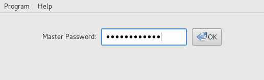
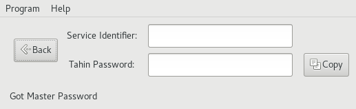

# Tahin (Gtk)

Github: https://github.com/mtesseract/tahin-gtk

This is a graphical frontend for the [Tahin password
generator](https://github.com/mtesseract/tahin-gtk).

Screenshots:

 

 
## Build Instructions

Use stack:

    $ stack build
